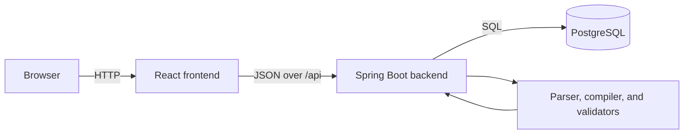

# SOP System MVP Principles

## Purpose and Decision Priority

This project is a locally demoable single-source-of-truth system for authoring, validating, publishing, and consuming Standard Operating Procedures (SOPs). Business users work in structured Markdown; the system compiles each publishable version into canonical JSON used by both the human view and the AI-facing API.

When requirements compete, optimize in this order:

1. Safety and correctness of published SOP decisions
2. One canonical contract for every consumer
3. A reliable end-to-end demo on one developer machine
4. Simplicity and speed of change
5. Production-scale concerns

The specification is expected to evolve. These principles are guardrails, not a commitment to speculative features or production infrastructure.

## MVP Boundary

The first usable slice must support one complete flow:

1. An author starts from the supported Markdown template.
2. The backend parses it without executing authored content.
3. Schema and semantic validation return business-readable results.
4. A permitted user completes the risk-appropriate simulated approval flow.
5. Publishing creates a versioned, validated canonical JSON snapshot.
6. The SOP list, human view, and AI JSON view read that same published snapshot.
7. If a newer active candidate is invalid, consumers continue to receive the last-known-good published version and the UI shows the problem.

The MVP includes the list and filters, human view, JSON view, editor, validation, publish flow, version/effective-date behavior, and the endpoints described in `spec.md`.

The MVP does **not** include real tool execution, external AI/vector stores, notifications, production identity providers, distributed queues, caches, search clusters, workflow engines, Kubernetes, or cloud-managed dependencies. Any such addition requires a demonstrated use case that cannot be met by the existing application and PostgreSQL.

## System Shape

Use a modular monolith with three runtime services:

- **React frontend:** authoring and review experience, validation display, list/filter views, and human/AI presentations. It contains no authoritative policy or validation logic.
- **Spring Boot backend (Java 21):** owns HTTP contracts, parsing, normalization, validation, lifecycle rules, authorization, version selection, and persistence.
- **PostgreSQL:** stores source Markdown, validation/publish state, approvals, and immutable canonical version snapshots. Database structure is an implementation detail; the canonical JSON API is the consumer contract.

Keep parsing, validation, publishing, and querying as modules inside one backend process. Module boundaries should be explicit enough to test independently, but they are not separate deployable services.

## Local-First Delivery

- A single `docker compose up --build` from the repository root must start the frontend, backend, and PostgreSQL with documented demo defaults.
- The compose setup must not require a cloud account, external API, locally installed database, or manually created network.
- Services must have health checks and start in dependency order based on readiness, not fixed sleeps.
- Demo data may be seeded deterministically through an explicit development profile or command. Re-running initialization must be safe.
- Configuration comes from environment variables with non-secret local defaults. Commit no real credentials; example values must be visibly non-production.
- Persist PostgreSQL data in a named volume and document the explicit command that removes it.
- Prefer framework capabilities and a small dependency set. Every added dependency must have a clear MVP purpose and must run within the compose environment.
- H2, if used at all, is limited to isolated unit tests. Integration and acceptance tests use PostgreSQL so that the tested behavior matches the demo runtime.

## Canonical Content and Versioning

- Structured Markdown is the authoring input. A successful publish produces the canonical, immutable JSON snapshot for that SOP version.
- Human and AI views must derive from the same canonical published snapshot. Do not maintain a separately edited human representation.
- Preserve submitted Markdown alongside its compiled result for traceability and re-validation.
- `sop_id` is the stable logical identifier; `version` identifies an immutable published snapshot.
- Drafts may change. A published version must never be silently overwritten; changes create a new version.
- Activation and effective-date selection must be deterministic and use UTC at the backend boundary.
- Publication must be atomic: validation, required approval checks, version persistence, and activation either all succeed or leave the prior published state unchanged.
- The last-known-good version is the only fallback. Never serve a partially parsed, failed, or unapproved candidate as active content.
- Compatibility is required for published API fields. Additive evolution is preferred; removing or changing meanings requires an explicit API/version migration.

## Parsing, Validation, and Decision Safety

- Treat all Markdown, YAML, expressions, links, and attachments as untrusted input.
- Never evaluate authored rule text with JavaScript `eval`, a shell, reflection, template execution, or an unrestricted expression engine.
- Parse only the documented front matter, required headings, and machine-critical YAML blocks. Unknown fields must follow one documented policy—reject or preserve—and that policy must be covered by contract tests.
- Reject duplicate keys, malformed YAML, ambiguous rule/action identifiers, dangling action references, and references to undeclared inputs.
- Machine-critical logic belongs in YAML blocks; prose cannot override rules, actions, boundaries, approvals, or limits.
- Validation has two visible stages: structural/schema checks and semantic/safety checks. Each violation must include a stable code, severity, human-readable message, and location or field when available.
- Publishing is blocked by validation errors. Warnings may be published only under one documented policy.
- Financial actions require an explicit limit and matching escalation behavior. High, critical, or regulatory SOPs must enforce the risk/autonomy and audit rules in `spec.md`.
- `assist` never permits tool execution. For this MVP, `guardrailed` and `autonomous` actions are represented and validated but execution is simulated; the UI and API must not imply a real external action occurred.
- Validation must be deterministic: identical content and rule-set versions produce identical results and canonical JSON, excluding explicitly documented server metadata.

## Interfaces and Contracts

- The backend is the sole public data authority. The frontend consumes documented JSON APIs rather than database details.
- Implement the MVP interfaces from `spec.md`: parse, validate, publish, list/filter, canonical detail, and human-readable detail. Choose and document one consistent base path and API version before implementation (`TBD`).
- Request and response DTOs are explicit. Persistence entities must not be exposed directly.
- OpenAPI is generated and kept consistent with implemented endpoints, status codes, and validation payloads.
- Filters use the controlled taxonomy values and have deterministic pagination and ordering once pagination is introduced.
- Errors use one JSON shape with a stable error code, message, request correlation identifier, and field-level details where relevant. Do not expose stack traces, SQL, secrets, or parser internals.
- Use conventional outcomes: `400` malformed input, `401` unauthenticated, `403` unauthorized, `404` absent resource, `409` lifecycle/version conflict, and `422` well-formed content that fails publish validation. Exact endpoint mappings are contract-tested.

## Security and Trust Boundaries

- The browser and all authored content are untrusted. Validate size, type, structure, identifiers, and authorization on the backend.
- Authentication and role details are not fully specified. Until decided, implement only a clearly labeled local demo identity mechanism and keep authorization behind a replaceable backend boundary (`TBD`).
- Enforce author, publisher/curator, and approver permissions server-side. Hiding buttons is not authorization.
- Approval requirements come from validated risk data and cannot be bypassed by client input.
- Render Markdown with raw HTML disabled or sanitized. Allow only safe URL schemes and prevent script/event-handler injection.
- Limit request and document sizes, YAML nesting, alias expansion, and parse time to resist resource-exhaustion inputs.
- Attachments are references in the MVP unless local upload behavior is explicitly added. Storage, type limits, malware handling, and access rules are `TBD`.
- Log lifecycle and validation events without logging secrets or unnecessarily duplicating authored sensitive content. Audit records must identify actor, SOP, version, action, result, and timestamp.

## Reliability and Failure Behavior

- Invalid input returns actionable validation results and never mutates the active version.
- A database outage makes write and canonical-read operations unavailable with a controlled error; do not fabricate successful publication.
- Duplicate publish requests and concurrent edits must not create conflicting active versions. Use database constraints and transactions before adding distributed locking.
- Backend and frontend expose lightweight health endpoints suitable for Compose checks. Readiness includes required database connectivity.
- No automatic retries for non-idempotent publish operations. If retries are introduced, require an idempotency strategy and tests.
- Expected failures are observable through structured logs and correlation IDs. A metrics platform is outside the MVP.

## Code and Change Guardrails

- Organize backend code by business capability or clear module boundary, not by speculative microservice boundaries.
- Keep controllers thin; parsing, validation, lifecycle, and version selection are independently testable domain/application behavior.
- Keep React components focused on presentation and interaction. Share generated or hand-maintained API types through one clear boundary; do not duplicate policy rules in TypeScript.
- Prefer boring, supported libraries for Markdown, safe YAML parsing, JSON, database migrations, and testing. Document why each non-Spring/non-React runtime dependency exists.
- Manage schema changes with versioned migrations from the first persistent model.
- Do not generalize the decision language beyond the constructs required by the sample and acceptance scenarios.
- A change is incomplete if it adds behavior without tests, alters an API without updating its contract, or makes the one-command demo harder to run.

## Evaluation Gates

These evals are the definition of done for generated or human-written implementation. They must be automated in the repository as the code is introduced. A pull request passes only when every required gate passes; `TBD`, skipped, or flaky checks do not count as passes.

| Gate | Required automated evidence | Pass condition |
|---|---|---|
| Build completeness | Backend Maven build and frontend production build | Clean checkout builds without undeclared local tools beyond Docker (or documented Java/Node workflow) |
| Backend quality | Unit tests, formatter/linter, and static analysis configured in Maven | Commands exit zero; no suppressed new high-severity findings |
| Frontend quality | Unit/component tests, lint, and TypeScript type-check | Commands exit zero with no type errors |
| Compose smoke | Build images, start Compose, wait for health, exercise the UI/API flow, then stop cleanly | All three services become healthy and the flow completes without manual repair |
| Contract | OpenAPI/HTTP tests for every implemented endpoint and error outcome | Runtime responses match documented status and JSON shapes |
| Parser fixtures | Valid template plus malformed front matter/YAML, missing/duplicate headings, duplicate keys, unsafe HTML, deep/aliased YAML, and unknown fields | Valid fixture compiles; every invalid fixture fails with the expected stable code and no code execution |
| Schema validation | Required fields, enum, type, date/version, action reference, and input reference cases | Each rule has positive and negative tests with readable locations |
| Semantic safety | Money limits/escalation, high-risk approvals, critical/regulatory autonomy, and tool-action audit fixtures | All unsafe fixtures block publish; compliant fixtures pass |
| Canonical consistency | Publish a fixture and query human and AI views | Both views identify the same `sop_id` and version and derive their policy/rules from identical canonical data |
| Lifecycle | Draft, validate, approve as required, publish, supersede, future-effective, and invalid-update cases | Only eligible versions activate; published versions remain immutable |
| Last-known-good | Corrupt or invalidate a newer candidate after one valid publish | Consumers still receive the prior valid version and the UI/API exposes a warning |
| Security | Role matrix, unauthorized access, XSS payloads, oversize input, and secret/stack-trace leakage tests | Server denies forbidden actions, rendered output is safe, limits apply, and errors leak no internals |
| Persistence | PostgreSQL integration tests, migrations from empty database, restart persistence, and transaction rollback | Tests use PostgreSQL; data survives restart; failed publish leaves no partial active state |
| Simplicity | Architecture/dependency check | Runtime remains frontend + backend + PostgreSQL; any exception has a recorded rationale |

### Required Golden Scenarios

Keep a small, version-controlled fixture set that includes at least:

1. The valid duplicate-charge SOP from `spec.md`, producing an approved canonical JSON snapshot.
2. A financial SOP missing `constraints.max_amount`, rejected with a stable semantic error.
3. A financial SOP missing the matching over-limit escalation, rejected.
4. A high-risk autonomous SOP without explicit permission/approval, rejected.
5. A critical or regulatory tool action without required audit fields, rejected.
6. A rule referring to an undeclared input or absent action, rejected.
7. Unsafe Markdown/HTML and hostile YAML fixtures, rendered or rejected safely.
8. A valid published version followed by an invalid candidate, proving last-known-good behavior.

Golden JSON comparisons must normalize intentionally variable metadata and otherwise use structural equality. Updating a golden file requires an explicit review of the contract change; tests must not rewrite expectations automatically.

### Verification Commands

The implementation must provide stable repository-level commands—preferably a small `Makefile` or documented scripts—for:

- `verify`: backend tests/quality checks plus frontend tests/lint/type-check/build
- `eval`: parser, schema, semantic, lifecycle, security, and golden-scenario suites
- `demo`: `docker compose up --build` with deterministic seed data
- `smoke`: health checks and the end-to-end acceptance flow against Compose

Exact commands are `TBD` until the Maven and React scaffolds exist. CI and local development must invoke the same underlying commands.

## MVP Exit Criteria

The MVP is demo-ready only when:

- A new developer can follow the README and complete the canonical author-to-consumer flow locally.
- Every acceptance criterion in `spec.md` is mapped to at least one automated eval.
- Required evaluation gates above pass from a clean checkout.
- No separate human and AI content sources exist.
- Invalid or unauthorized content cannot become active.
- The application has no required runtime service beyond the frontend, backend, and PostgreSQL.
- Known gaps are recorded as `TBD` or explicitly deferred, not silently assumed.

## Architectural Gaps / Information Requested

The specification does not yet establish the following. Keep these as `TBD` until a product or architecture decision is recorded:

- API base path/version and exact request/response/error schemas
- Authentication mechanism and the precise author/publisher/approver authorization matrix
- Whether one user can hold multiple roles and whether self-approval is forbidden
- Approval requirements for low and medium risk, and what explicitly permits high-risk autonomy
- The safe condition-expression grammar and how rule priority, ties, and no-match outcomes behave
- Unknown-field handling, warning publication policy, and canonical normalization details
- Version conflict behavior, effective-date overlap rules, and timezone presentation
- Taxonomy ownership and whether vocabulary values are configured or code-managed
- Attachment storage and security behavior
- Data retention, audit retention, and deletion requirements
- Pagination, maximum document size, and other operational limits

Resolve these only when needed for the next demo slice. Until then, implementations must fail safely and avoid locking the project into unnecessary infrastructure.
