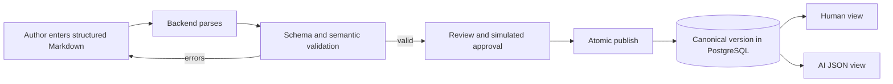

# SOP System MVP Requirements

## 1. Document Control

| Item | Value |
|---|---|
| Product | Single Source of Truth SOP System |
| Release | MVP / local demo |
| Status | Draft requirements baseline |
| Primary sources | `spec.md`, `PRINCIPLES.md` |
| Backend | Java 21, Spring Boot |
| Frontend | React |
| Persistence | PostgreSQL |
| Deployment target | Local Docker Compose |

Normative terms have their usual meaning: **must** is required for MVP acceptance, **should** is recommended but not release-blocking unless an acceptance criterion says otherwise, and **may** is optional. Unresolved requirements are marked `TBD` and are not permission to invent behavior.

## 2. Product Outcome

The MVP must demonstrate that a business-authored, structured Markdown SOP can safely become a versioned canonical JSON SOP and be consumed through both a readable human view and an AI-oriented JSON API without creating two sources of truth.

The primary success path is:

## 3. Users and Roles

| Actor | MVP goal | Required capabilities |
|---|---|---|
| Business SME / Author | Create and correct an SOP using a known template | Start a draft, edit Markdown, parse, validate, view errors, submit for review |
| KM Publisher / Curator | Publish a compliant SOP | Review content and validation results, complete eligible publication |
| QA / Compliance Approver | Approve SOPs when risk policy requires it | Review the candidate and record a simulated approval or rejection |
| Human Consumer | Follow the currently effective SOP | Search/filter SOPs and read a safe rendered view |
| Automation Consumer | Retrieve machine-readable policy | Query the currently effective canonical JSON |
| Demo Operator | Run and demonstrate the product locally | Start, seed, verify, and stop the complete stack using documented commands |

Authentication mechanics, role assignment, self-approval rules, and the exact approval matrix remain `TBD`. Regardless of the chosen demo identity mechanism, authorization must be enforced by the backend.

## 4. MVP Scope

### 4.1 Included

- Structured Markdown authoring with template insertion
- Parsing of YAML front matter, required Markdown sections, and machine-critical YAML blocks
- Structural/schema validation and business semantic validation
- Business-readable validation feedback
- Draft, review/approval simulation, publish, version, effective-date, and deprecate behavior
- Immutable canonical JSON for published SOP versions
- SOP list and taxonomy/scope filtering
- Safe human-readable SOP detail
- AI-oriented canonical JSON detail
- Last-known-good fallback and visible warning
- Local audit trail for lifecycle events
- OpenAPI documentation for implemented backend endpoints
- Deterministic demo seed data
- Automated tests and evaluation fixtures
- One-command local startup through Docker Compose

### 4.2 Excluded

- Real execution of SOP tool actions
- Real ticket, billing, CRM, notification, or AI/vector-store integrations
- Production SSO or enterprise identity integration
- Distributed queues, caches, search clusters, workflow engines, or microservices
- Kubernetes or cloud deployment
- Collaborative real-time editing
- General-purpose policy-language execution
- Production-grade attachment upload and malware scanning
- Advanced analytics, reporting, or notification delivery

The UI may visibly simulate approvals and downstream refresh notifications, but it must label them as simulations and must not claim an external action occurred.

## 5. Functional Requirements

### 5.1 Application Access and Demo Identity

#### FR-001 — Demo identity

The system must provide a local-only way to act as each required human role without an external identity provider.

Acceptance criteria:

1. Given a clean local startup, when the user opens the application, then the user can select or otherwise obtain a seeded demo identity.
2. Given an author identity, when it attempts a publisher- or approver-only operation, then the backend rejects the operation with `403`.
3. Given no valid identity, when a protected mutation is requested, then the backend returns `401`.
4. The UI must visibly identify the active demo user and role.
5. The mechanism must be labeled as demo-only in documentation and configuration.

#### FR-002 — Role enforcement

The backend must authorize lifecycle actions according to the role model.

Acceptance criteria:

1. Authors can create, edit, parse, validate, and submit drafts.
2. Publishers can review and publish candidates that satisfy validation and approval requirements.
3. Approvers can approve or reject candidates that require their role.
4. Consumers can read only eligible published SOPs.
5. Direct API calls cannot bypass a restriction enforced in the UI.

The exact multi-role and self-approval rules are `TBD`.

### 5.2 SOP Authoring

#### FR-010 — Create a draft

An author must be able to create a draft SOP from the minimum viable template in `spec.md`.

Acceptance criteria:

1. The editor provides an action that inserts the supported template into an empty draft.
2. Template insertion includes all required front-matter keys and required section headings.
3. Creating or saving a draft does not make it visible as an active SOP to consumers.
4. The source Markdown is preserved exactly enough to reopen and continue editing it.

#### FR-011 — Edit and preserve source

An author must be able to edit and save structured Markdown before publication.

Acceptance criteria:

1. Saved source remains available after backend and browser restart.
2. Editing a draft does not modify an already published version.
3. The UI indicates unsaved changes and reports save failures without discarding editor content.
4. Concurrent update behavior is `TBD`; until resolved, an update must not silently overwrite a newer saved revision.

#### FR-012 — Authoring structure

The parser must recognize the documented front matter and these level-two sections:

- Intent (When to use)
- Do Not Use When
- Inputs Required
- Eligibility Rules
- Actions
- Boundaries
- Customer Messages
- Human UI Guidance (optional)

Acceptance criteria:

1. A document matching the template is parsed into a structured intermediate result.
2. A missing required section produces a validation error naming the section.
3. A duplicated machine-critical section produces a validation error rather than ambiguous output.
4. Human UI Guidance may be absent without causing a required-section error.
5. Machine-critical values are sourced from their YAML blocks and cannot be overridden by prose.

### 5.3 Parsing and Compilation

#### FR-020 — Safe deterministic parsing

The backend must parse Markdown and YAML as untrusted data without executing authored content.

Acceptance criteria:

1. Malformed front matter or YAML returns a controlled validation result with a stable code and location when available.
2. Duplicate YAML keys are rejected.
3. YAML alias expansion, nesting, and document size are bounded.
4. Script, shell, template, or expression payloads are never executed during parsing or rendering.
5. Parsing identical source under the same parser/rule-set version yields structurally identical output.

#### FR-021 — Canonical compilation

A valid candidate must compile to the high-level canonical model defined in `spec.md`.

Acceptance criteria:

1. The result contains the applicable identity, ownership, scope, classification, risk, policy, decision model, actions, boundaries, customer messages, human guidance, references, and changelog fields.
2. Optional absent data is represented consistently according to the API contract and is not fabricated.
3. `sop_id` remains the stable logical identifier across versions.
4. The compiler reports invalid or unrepresentable input rather than silently dropping machine-critical content.
5. Canonical normalization and unknown-field handling remain `TBD` and must be decided before contract baselines are frozen.

#### FR-022 — Parse preview

The editor must allow an author to inspect parsing results without saving or publishing a version.

Acceptance criteria:

1. Invoking parse returns the structured preview and any parse/schema issues.
2. A parse preview causes no active-version mutation.
3. The UI distinguishes preview output from published canonical JSON.

### 5.4 Validation

#### FR-030 — Front-matter validation

The backend must validate the required front-matter fields and enumerations in `spec.md`.

Acceptance criteria:

1. Missing `sop_id`, `title`, `status`, `version`, `effective_start`, `owner_team`, `domain`, `capability`, `intents`, `risk_level`, or `max_autonomy` produces an error for each missing field.
2. `status` accepts only `draft`, `active`, or `deprecated`.
3. `risk_level` accepts only `low`, `medium`, `high`, or `critical`.
4. `max_autonomy` accepts only `assist`, `guardrailed`, or `autonomous`.
5. Invalid dates are rejected. Whether strict semantic versioning is mandatory is `TBD`.

#### FR-031 — Reference validation

The backend must validate references between inputs, rules, and actions.

Acceptance criteria:

1. Every action ID referenced by a rule resolves to exactly one declared action.
2. Every rule input reference resolves to a declared required input.
3. Duplicate rule IDs and duplicate action IDs are rejected.
4. Errors identify the rule/action and unresolved reference.
5. Cross-SOP routing references are retained; whether the target must already exist is `TBD`.

#### FR-032 — Financial safety validation

The backend must enforce explicit safety constraints for financial SOPs.

Acceptance criteria:

1. If an intent or tag implies refund or credit, applicable financial actions require an explicit `constraints.max_amount` or documented equivalent.
2. The boundaries require escalation for an amount above that limit.
3. Missing limits or escalation behavior blocks publication.
4. The valid duplicate-charge example in `spec.md` passes these checks.
5. The exact controlled list of money-related intents/tags is `TBD` and must be versioned with the validation rule set.

#### FR-033 — Risk and autonomy validation

The backend must enforce the risk-tier rules from `spec.md`.

Acceptance criteria:

1. A high-risk SOP contains at least one approval rule.
2. A high-risk SOP with autonomous behavior is rejected unless the future explicit-allowance rule is satisfied; that allowance rule is `TBD`.
3. A regulatory or critical SOP uses `assist` or compliant strict `guardrailed` autonomy.
4. Tool actions in regulatory or critical SOPs contain required audit configuration.
5. A violation blocks publication and explains the applicable risk rule.

#### FR-034 — Validation result contract

Validation results must be understandable by a business author and stable enough for automation.

Acceptance criteria:

1. Each issue contains a stable code, severity, message, and field or source location when available.
2. Results separate schema/structural issues from semantic/safety issues.
3. The UI groups or labels issues by stage and navigates or points the author to the affected content.
4. Errors block publish. Warning publication policy is `TBD`.
5. Re-validating unchanged input with the same rule-set version yields the same ordered issue set.

### 5.5 Review, Approval, and Publication

#### FR-040 — Submit for review

An author must be able to submit a draft for review after validation.

Acceptance criteria:

1. A draft with validation errors cannot enter a publishable review state.
2. Submission records the candidate source, canonical preview, validation result/rule-set version, actor, and timestamp.
3. Subsequent source changes invalidate prior candidate validation and approvals.

#### FR-041 — Simulated approval

The MVP must demonstrate risk-tier approval without integrating an external workflow system.

Acceptance criteria:

1. A candidate requiring approval displays the required approval status.
2. An authorized demo approver can approve or reject it.
3. Approval or rejection records actor, role, candidate version, outcome, and timestamp.
4. A rejected candidate cannot publish until corrected, revalidated, and resubmitted.
5. The exact low/medium/high/critical approval matrix is `TBD`.

#### FR-042 — Atomic publish

An authorized publisher must be able to publish only a valid and sufficiently approved candidate.

Acceptance criteria:

1. Publish rechecks or verifies current validation and approval eligibility on the backend.
2. Successful publish stores the source and immutable canonical JSON for the identified version.
3. Validation, approval checks, persistence, and activation complete atomically.
4. Any failure leaves the previous active version unchanged and returns a controlled error.
5. Duplicate or concurrent publish attempts cannot produce two conflicting active versions.
6. No tool call or external business action is executed during publish.

#### FR-043 — Version immutability

Published content must be changed by creating a new version, never by overwriting history.

Acceptance criteria:

1. Attempts to modify a published snapshot are rejected.
2. A new draft may be created from a published SOP while retaining the same `sop_id` and a new version.
3. Published source and canonical JSON remain retrievable for traceability by authorized review users.
4. Version conflict and version increment policy are `TBD`.

#### FR-044 — Effective and deprecated versions

The system must select the eligible canonical version deterministically.

Acceptance criteria:

1. A future-effective version is not served as the current active SOP before its start time.
2. At the effective time, an eligible version becomes the selected current version without mutating its canonical snapshot.
3. Deprecated content is not returned in default active-only consumer results.
4. Backend timestamps and comparisons use UTC.
5. Effective-date overlap, end-date, and timezone display rules are `TBD`.

#### FR-045 — Last-known-good fallback

The system must protect consumers from an invalid newer candidate or invalid active selection.

Acceptance criteria:

1. Given one valid published version and a newer invalid candidate, consumer endpoints continue serving the valid published version.
2. The author/reviewer UI shows that the newer candidate failed and that fallback content is being served.
3. A failed candidate is never labeled or returned as active canonical content.
4. If no valid published version exists, the consumer receives a controlled not-found/unavailable outcome rather than draft content.

### 5.6 SOP Discovery and Consumption

#### FR-050 — SOP list

Users must be able to list SOPs visible to their role.

Acceptance criteria:

1. Consumer results default to eligible published SOPs.
2. Review users can distinguish draft, in-review, active, future-effective, rejected, and deprecated content as supported by the finalized lifecycle model.
3. Each list item includes enough metadata to identify the SOP, title, version, status, classification, risk, and effective start.
4. Empty results display a clear empty state rather than an error.
5. Ordering is deterministic. Pagination requirements are `TBD`.

#### FR-051 — Filtering

The SOP list must support the filters required by `spec.md`.

Acceptance criteria:

1. Users can filter by domain, intent, risk, status, region, and channel.
2. Supported scope filters also include capability, customer segment, product, systems, language, regulatory flag, and max autonomy when those fields are populated.
3. Combining filters returns only records satisfying the documented combination semantics.
4. Filter options and results use the same controlled vocabulary values.
5. Invalid filter values produce a controlled client error or an explicitly documented empty result, not a server error.

#### FR-052 — Human SOP view

The application must render the current canonical SOP for human consumption.

Acceptance criteria:

1. The view shows title, identity/version, status/effective information, ownership, scope/classification, risk, policy, rules/actions, boundaries, customer messages, and available human guidance.
2. Content is derived from the selected canonical JSON snapshot, not a separately edited representation.
3. Raw HTML is disabled or sanitized, unsafe URL schemes are rejected, and script/event-handler content cannot execute.
4. Missing optional guidance or attachment references do not break the page.
5. A fallback warning is visible when last-known-good behavior is active.

#### FR-053 — AI canonical JSON view

Automation consumers must be able to retrieve the selected canonical SOP as JSON.

Acceptance criteria:

1. The response is valid JSON and conforms to the documented canonical contract.
2. The response identifies `sop_id`, version, status, effective interval, and validation/rule-set provenance as finalized by the contract.
3. The returned version is the same version used by the human view.
4. Draft, invalid, or unapproved content is not returned as current canonical content.
5. The endpoint performs no rule or tool execution.

### 5.7 Taxonomy

#### FR-060 — Controlled vocabulary

The MVP must use the starter taxonomy from `spec.md` for classification and filtering.

Acceptance criteria:

1. Domain, capability, journey, and intent values are preserved in canonical JSON.
2. Intents follow `verb_object[_context]` where enforced by the finalized validation policy.
3. The frontend presents supported taxonomy values consistently with backend validation.
4. Unknown or new taxonomy values follow one documented policy and do not silently map to an unrelated value.
5. Taxonomy ownership and whether values are code- or data-managed are `TBD`.

### 5.8 Audit and Diagnostics

#### FR-070 — Lifecycle audit

The backend must record locally useful audit events for material lifecycle changes.

Acceptance criteria:

1. Save, submit, validation, approve/reject, publish, activation, and deprecation events record actor, SOP, version/candidate, action, result, and UTC timestamp.
2. Failed publication is recorded without exposing secrets or full sensitive content in logs.
3. Audit records survive application restart with PostgreSQL data intact.
4. Audit retention and end-user audit UI are `TBD`; a dedicated audit UI is not required for MVP.

#### FR-071 — Error responses

All backend errors must use one documented JSON envelope.

Acceptance criteria:

1. The envelope includes a stable error code, human-readable message, correlation identifier, and field details when applicable.
2. The API uses conventional `400`, `401`, `403`, `404`, `409`, and `422` outcomes as defined in `PRINCIPLES.md`.
3. Responses never expose stack traces, SQL, secrets, internal file paths, or parser implementation details.
4. Unexpected failures return a correlation identifier that appears in structured backend logs.

## 6. Interface Requirements

### 6.1 Backend operations

The backend must expose versioned HTTP operations equivalent to:

| Operation | Purpose | Mutation |
|---|---|---|
| Parse | Parse source and return preview/issues | No active-state mutation |
| Validate | Return schema and semantic results | No active-state mutation |
| Save draft | Persist editable source | Draft only |
| Submit | Freeze a review candidate | Review state |
| Approve/reject | Record simulated human decision | Approval state |
| Publish | Persist/activate immutable canonical version | Atomic publication |
| List SOPs | Return role-appropriate, filterable summary | None |
| Get canonical SOP | Return selected canonical JSON | None |
| Get rendered SOP | Return or support a human-readable view | None |

The exact API base path, resource paths, payload schemas, and whether rendering is returned as safe HTML or performed by React from canonical JSON are `TBD`. They must be fixed in OpenAPI before contract tests are baselined.

### 6.2 API behavior

#### IR-001 — Contract documentation

Acceptance criteria:

1. Every implemented endpoint appears in generated OpenAPI.
2. OpenAPI documents authentication, parameters, success schemas, error envelope, and meaningful status codes.
3. Contract tests fail when runtime responses drift from documented shapes.

#### IR-002 — Request safety

Acceptance criteria:

1. The backend applies a documented request/document size limit.
2. Unsupported content types return a controlled client error.
3. Invalid identifiers and filter values cannot reach persistence as unsafe query fragments.
4. CORS is limited to the local frontend origin in the Compose profile.

#### IR-003 — Consumer consistency

Acceptance criteria:

1. The human and AI detail operations resolve the same current version for the same SOP and time.
2. Both expose the same policy, decision rules, actions, and boundaries in their appropriate representations.
3. A golden acceptance test compares both consumers against one published fixture.

## 7. Data Requirements

#### DR-001 — Persistent records

PostgreSQL must persist, at minimum:

- Stable SOP identity
- Editable draft source and revision/concurrency metadata
- Frozen review candidates and validation provenance
- Approval decisions
- Published version metadata and original source
- Canonical JSON snapshots
- Effective and lifecycle status information
- Lifecycle audit records

Acceptance criteria:

1. Required records survive backend and database container restart when the named volume is retained.
2. Database migrations can initialize an empty database without manual SQL.
3. Re-running migrations is safe.
4. A failed publish transaction leaves no partial published or active record.

#### DR-002 — Canonical version integrity

Acceptance criteria:

1. Published `(sop_id, version)` identity is unique.
2. At most one version is selected as current for a logical SOP at a given effective instant under the finalized overlap policy.
3. Published source, canonical JSON, and validation provenance remain associated.
4. Application constraints and database constraints protect core uniqueness and immutability invariants.

#### DR-003 — Seed data

Acceptance criteria:

1. An explicit demo profile or seed command loads the valid duplicate-charge SOP and required demo users/roles.
2. Seed execution is deterministic and idempotent.
3. Seed data is visibly non-production and contains no real secrets or customer data.

## 8. Non-Functional Requirements

### 8.1 Local operation

#### NFR-001 — One-command startup

Acceptance criteria:

1. From a clean checkout with Docker available, `docker compose up --build` starts React, Spring Boot, and PostgreSQL.
2. No cloud account, external service, local database, or manually created network is required.
3. All services reach healthy status without fixed startup sleeps.
4. The README identifies the UI and API documentation URLs and the demo flow.

#### NFR-002 — Shutdown and persistence

Acceptance criteria:

1. Normal Compose shutdown stops all services cleanly.
2. Restart retains data through a named PostgreSQL volume.
3. Documentation provides a separate explicit command for removing demo data.

### 8.2 Performance and limits

#### NFR-010 — Demo responsiveness

For the documented seed dataset and supported local hardware profile (`TBD`), normal list, detail, parse, and validate interactions should complete within one second at the backend under no contention; publish should complete within two seconds.

Acceptance criteria:

1. An automated local smoke measurement checks these targets with an agreed tolerance.
2. A parser limit test demonstrates that oversized or pathological input is rejected within a bounded time.
3. Performance failure does not result in partial publication.

These are demo targets rather than production service-level objectives.

### 8.3 Security

#### NFR-020 — Untrusted content handling

Acceptance criteria:

1. XSS fixtures cannot execute in the human view.
2. Hostile YAML fixtures cannot cause unbounded alias expansion or object construction.
3. Rule expressions and template-like strings are stored/validated as data and never executed.
4. Unsafe links are removed or rejected.

#### NFR-021 — Secrets and configuration

Acceptance criteria:

1. Configuration is supplied through environment variables with safe, non-secret local defaults.
2. No production credential or reusable secret is committed.
3. Logs and API errors do not reveal credentials.

### 8.4 Reliability

#### NFR-030 — Health and readiness

Acceptance criteria:

1. Backend health distinguishes liveness from readiness and includes required database connectivity in readiness.
2. PostgreSQL has a Compose health check.
3. Frontend health confirms it can serve the built application.
4. Compose startup depends on readiness where supported.

#### NFR-031 — Database failure

Acceptance criteria:

1. When PostgreSQL is unavailable, writes and canonical reads return a controlled unavailable response.
2. The application never reports a successful publish when its transaction did not commit.
3. Recovery after PostgreSQL becomes ready does not require rebuilding containers.

### 8.5 Maintainability and simplicity

#### NFR-040 — Runtime simplicity

Acceptance criteria:

1. The required runtime contains exactly the React frontend, Spring Boot backend, and PostgreSQL unless an exception is documented and approved.
2. No queue, cache, separate search engine, workflow service, or external SaaS is needed for the demo.
3. Parsing, validation, publication, and querying remain modules in one backend deployment.

#### NFR-041 — Build quality

Acceptance criteria:

1. Backend compile, tests, format/lint, and configured static analysis pass.
2. Frontend tests, lint, TypeScript type-check, and production build pass.
3. Integration tests exercise PostgreSQL rather than substituting H2 for database-specific behavior.
4. New runtime dependencies include an MVP rationale.

### 8.6 Accessibility and usability

#### NFR-050 — Demo usability

Acceptance criteria:

1. A new user can complete the author-to-publish-to-consume demo using visible UI actions and the README.
2. Validation feedback is readable, identifies the affected content, and does not require reading server logs.
3. Status, validation severity, and approval state are not conveyed by color alone.
4. Editor, validation actions, filter controls, and detail content are keyboard operable.

## 9. Required Evaluation Suite

The repository must implement the following eval groups as code is scaffolded. These requirements define the minimum evidence for MVP completeness.

| Eval ID | Coverage | Required evidence |
|---|---|---|
| EV-001 | Build | Backend and frontend clean builds |
| EV-002 | Parser | Valid template, malformed Markdown/YAML, duplicate sections/keys, hostile YAML |
| EV-003 | Schema | Required fields, enums, types, dates, IDs, and references |
| EV-004 | Semantics | Financial limits/escalation and risk/autonomy/audit rules |
| EV-005 | Lifecycle | Draft, submit, approve/reject, publish, supersede, future-effective, deprecate |
| EV-006 | Canonical contract | Golden canonical JSON for the specification example |
| EV-007 | Consumer consistency | Human and AI views resolve the same canonical version and policy |
| EV-008 | Last-known-good | Invalid newer candidate cannot replace the prior valid version |
| EV-009 | Authorization | Role matrix and direct API bypass attempts |
| EV-010 | Content security | XSS, unsafe URLs, oversized input, nesting/alias limits, leakage |
| EV-011 | Persistence | Migrations, PostgreSQL behavior, restart persistence, rollback |
| EV-012 | Compose smoke | Clean build, health, seeded end-to-end demo, clean shutdown |
| EV-013 | API contract | OpenAPI and runtime success/error response conformance |
| EV-014 | Simplicity | Runtime service/dependency architecture check |

### 9.1 Mandatory golden fixtures

The eval suite must include:

1. The valid duplicate-charge example from `spec.md`.
2. A financial SOP without a maximum amount.
3. A financial SOP without matching over-limit escalation.
4. A high-risk autonomous SOP without explicit allowance/approval.
5. A critical or regulatory tool action without required audit fields.
6. A rule with an undeclared input.
7. A rule with an absent action.
8. Duplicate YAML keys and duplicate machine-critical sections.
9. Unsafe Markdown/HTML/URL content and pathological YAML.
10. A valid published SOP followed by an invalid newer candidate.

Golden comparisons must be structural, normalize only documented variable metadata, and never rewrite expected results automatically.

### 9.2 Repository verification commands

The implementation must expose stable root-level commands for:

- `verify` — backend and frontend builds, tests, lint/type/static checks
- `eval` — all domain, contract, security, and golden suites
- `demo` — build and start the seeded Compose application
- `smoke` — execute the primary acceptance journey against Compose

Exact command syntax remains `TBD` until project scaffolding exists. Local development and CI must call the same underlying tasks.

## 10. End-to-End MVP Acceptance Scenarios

### AC-E2E-001 — Successful author-to-consumer journey

Given the seeded demo stack and an author identity, when a user inserts the template, completes a compliant duplicate-charge SOP, saves it, parses it, validates it, submits it, completes required simulated approval as an eligible approver, and publishes as a publisher, then:

- publication succeeds exactly once;
- canonical JSON is persisted with the requested SOP identity and version;
- the SOP appears in matching list/filter results;
- the human view renders its policy and guidance safely;
- the AI view returns the same version and decision content;
- lifecycle audit events identify the demo actors and outcomes.

### AC-E2E-002 — Corrective validation journey

Given a financial SOP missing a maximum amount and escalation rule, when the author validates it, then publication is blocked and separate business-readable issues identify both safety gaps. When the author corrects both issues and revalidates, those issues disappear without changing any active version.

### AC-E2E-003 — Approval enforcement

Given a candidate whose finalized risk policy requires approval, when an author or publisher attempts to bypass approval through the API, then publication is rejected. When the correct demo approver approves the unchanged candidate, an authorized publisher can publish it.

### AC-E2E-004 — Version and effective date

Given an active SOP version, when a valid new future-effective version is published, then the old version remains current before the effective instant and the new version becomes current at the effective instant according to the finalized overlap policy. Both published snapshots remain immutable.

### AC-E2E-005 — Last-known-good protection

Given a valid published SOP, when a newer candidate fails runtime or publish validation, then consumer endpoints continue returning the previous valid version, the UI exposes a fallback warning, and the invalid candidate is never returned as active.

### AC-E2E-006 — Safe hostile input

Given Markdown containing executable HTML, unsafe links, expression payloads, or pathological YAML, when the content is parsed, validated, and previewed, then no payload executes, bounded inputs fail with controlled issues, no active version changes, and responses expose no internal details.

### AC-E2E-007 — Local reproducibility

Given a clean checkout and Docker, when the operator follows the README and runs the documented demo command, then all three services become healthy, deterministic seed data is available, the successful acceptance journey can be demonstrated without external services, and restart retains published data.

## 11. Traceability

| Source acceptance statement | Requirements | Primary evals |
|---|---|---|
| Business user can create an SOP via template | FR-010–FR-012 | EV-002, EV-012 |
| Validation catches missing limits/fields and explains them | FR-030–FR-034 | EV-003, EV-004 |
| Publish produces canonical JSON | FR-021, FR-040–FR-043 | EV-005, EV-006 |
| Human and AI views derive from the same SOP | FR-052, FR-053, IR-003 | EV-007 |
| Filters and taxonomy work | FR-050, FR-051, FR-060 | EV-013 |
| Changes increment version and activate with effective dates | FR-043, FR-044 | EV-005 |
| Last-known-good version protects consumers | FR-045 | EV-008 |
| Local lightweight demo | NFR-001, NFR-002, NFR-040 | EV-012, EV-014 |

## 12. Release Exit Criteria

The MVP is accepted only when:

1. AC-E2E-001 through AC-E2E-007 pass in the documented local environment.
2. EV-001 through EV-014 pass without skipped, flaky, or manually waived required checks.
3. Every implemented endpoint is documented and contract-tested.
4. Published canonical snapshots are immutable and human/AI consumption is consistent.
5. Invalid, unsafe, or unauthorized content cannot become active.
6. The required runtime remains React, Spring Boot, and PostgreSQL under Docker Compose.
7. The README enables a new developer to run the demo from a clean checkout.
8. All release-blocking `TBD` decisions listed below are resolved and reflected in contract tests.

## 13. Open Decisions / Information Requested

The following are unresolved in `spec.md` and `PRINCIPLES.md`:

| ID | Decision needed | Blocks |
|---|---|---|
| TBD-001 | API base path, resource paths, and exact request/response/error schemas | OpenAPI and contract baseline |
| TBD-002 | Demo authentication mechanism and role assignment | Authorization implementation |
| TBD-003 | Multi-role behavior and whether self-approval is prohibited | Approval acceptance tests |
| TBD-004 | Approval matrix for each risk tier and explicit high-risk autonomy allowance | Publish eligibility |
| TBD-005 | Safe rule-condition grammar, priorities, ties, and no-match behavior | Full expression/reference validation |
| TBD-006 | Unknown-field policy, warning publication policy, and normalization rules | Canonical golden contracts |
| TBD-007 | Version increment/conflict and effective-date overlap/end-date rules | Lifecycle contract |
| TBD-008 | Taxonomy ownership and extension policy | Taxonomy validation |
| TBD-009 | Attachment reference/storage, type, access, and safety rules | Attachment rendering beyond references |
| TBD-010 | Retention and deletion requirements for source, versions, and audit | Long-term data lifecycle |
| TBD-011 | Pagination, maximum document size, YAML complexity, and supported local hardware limits | Operational limit tests |
| TBD-012 | Server-rendered HTML versus React rendering from canonical JSON | Rendered endpoint/UI contract |

TBD-001 through TBD-007 and TBD-011 are release-blocking where they affect executable acceptance tests. The remaining decisions may be deferred by keeping the associated capability within the stated MVP limitation.
